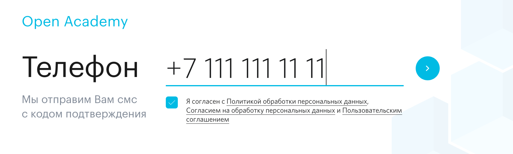
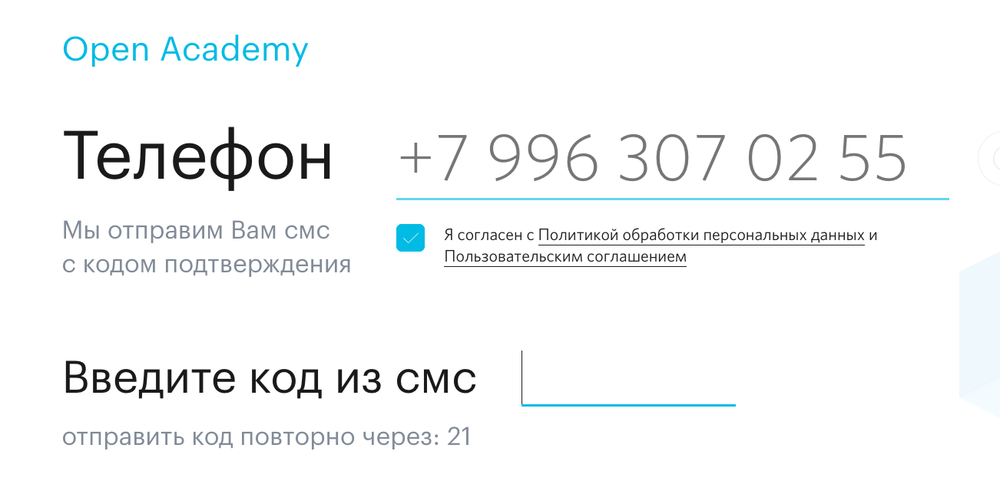
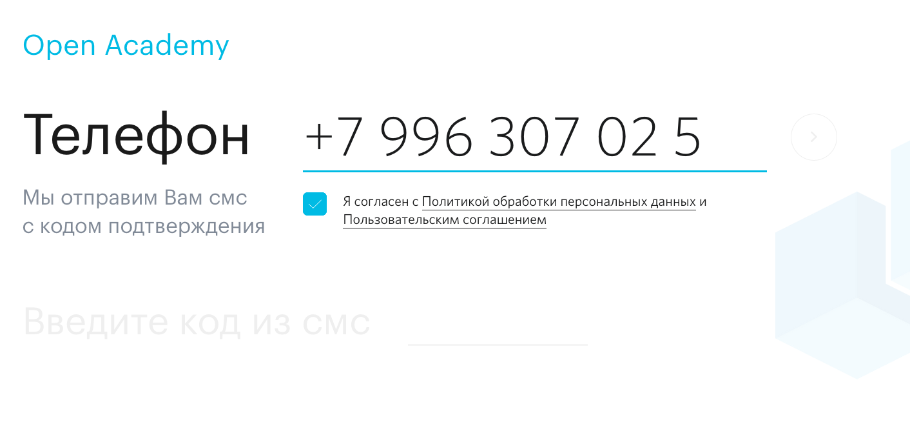

# Авторизация/регистрация

Ссылка: [https://academyopen.ru/profile](https://academyopen.ru/profile)

Схема Flow Профилирования - [https://miro.com/app/board/o9J_kwpNsQI=/?moveToWidget=3074457346833687924](https://miro.com/app/board/o9J_kwpNsQI=/?moveToWidget=3074457346833687924)

Страница используется как для авторизации, так и для регистрации пользователя.

## Блоки страницы:

1. Ввод номера телефона (авторизация / регистрация)
2. Ввод кода смс (авторизация / регистрация)
3. Ввод имени  (регистрация)

## 1 - Ввод номера телефона

Используется для ввода номера телефона с автоматическим форматированием в процессе ввода и подтверждения согласия пользователя с правилами сервиса.

В данный момент поддерживаются только мобильные номера РФ.

Для отправки кода смс необходимо:

1. Ввести корректный для РФ номер телефона
2. Проставить чекбокс согласия с соглашениями:
    1. **[Политика обработки персональных данных](./Authorization_registration/Personal_data.md)** 
    2. **[Согласие на обработку персональных данных](./Authorization_registration/Consent_processing.md)** 
    3. **[Пользовательское соглашение](./Authorization_registration/Agreement.md)** 

## 2 - Ввода кода смс

Блок для ввода кода смс-подтверждения. Поддерживает ввод только 4-ех цифр

## 3 - Ввод имени

Блок для ввода имени при регистрации в свободном формате без валидации.

## Общая логика работы авторизации / регистрации

**1) Пользователь вводит валидный номер телефона и ставит чекбокс согласия с правилами сервиса**

После данного действия кнопка рядом с номером телефона становится активной и при ее нажатии происходит запрос кода смс-доступа:

**1.1) После запроса кода СМС пользователь имеет возможность изменить введенный номер телефона.** 

После запроса СМС кода (*скриншот 1*) при клике на поле ввода телефона и изменения хотя бы ОДНОГО символа в номере - экран переходит с состояние заполнения номера телефона (*скриншот 2*), при этом старый СМС код становится невалидным.

***Скриншот 1***

**Скриншот 2**

**1.2) После запроса кода смс кнопка рядом с полем ввода номера телефона меняется на кнопку переотправки кода смс:**

При запросе переотправки кода смс имеется ограничение в 30 секунд на повторный запрос кода (еще одно нажатие кнопки)

**2) Ввод кода смс**

При вводе кода смс происходит его автоматическая проверка при заполнении последней из 4-ех цифр кода.

2.1) Если код смс верный и пользователь уже зарегистрирован - происходит автоматический переход в Личный кабинет пользователя

2.2) Если код смс верный и пользователь не зарегистрирован - отображается поля ввода имени

2.3) Если код смс не верный - см. ижу

**3) После ввода некорректного СМС-код пользователь должен иметь возможность ввести новый СМС-код (не более двух раз)**

После первой некорректной попытки ввести смс код пользователь имеет возможность изменить код в поле ввода, который АВТОМАТИЧЕСКИ отправляется на проверку.

Кол-во попыток необходимо ограничить, после достижения ограничения:

- Поле ввода СМС кода должно становиться неактивным
- Текст ошибки под полем ввода должен меняться на "Вы исчерпали лимит попыток ввода СМС-кода, отправить новый?"
    - Текст "Отправить новый?" должен выводиться в виде кликабельной ссылки, при клике на который отправляется новый СМС-код и поле ввода СМС-кода автоматически очищается от контента и ошибок. ***Далее следует логика из пункта 1.2***
