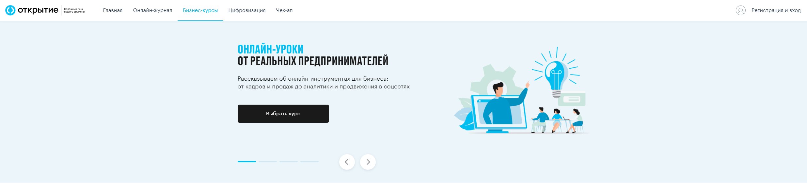
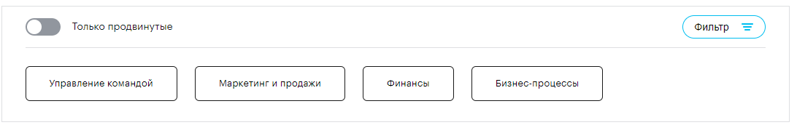
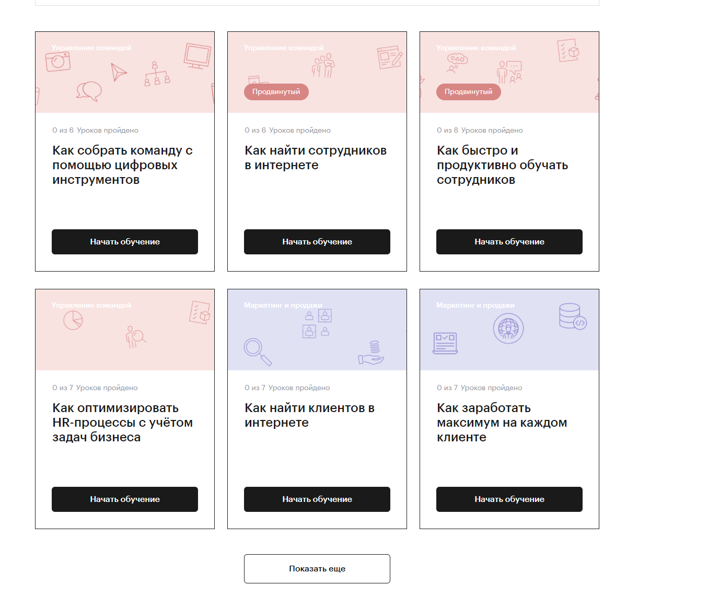
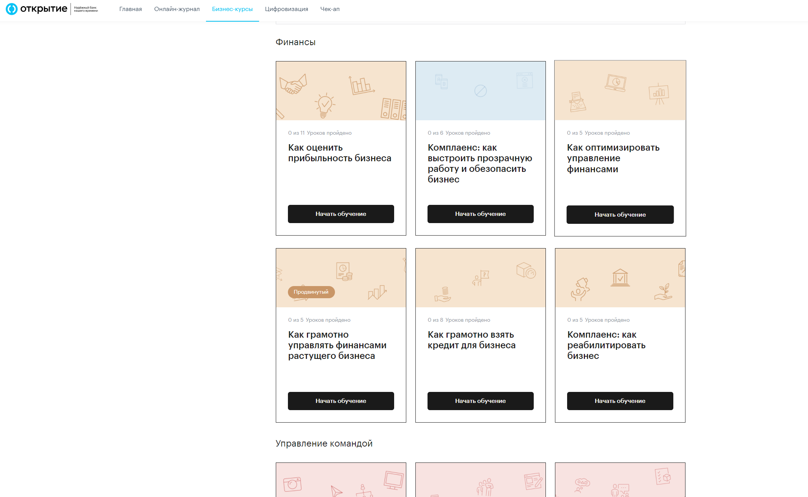
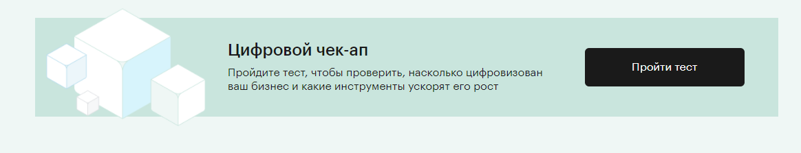
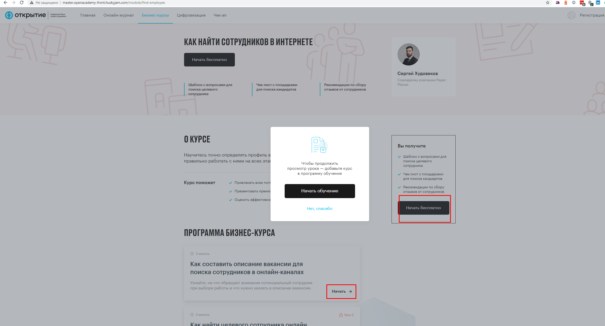

# Бизнес курсы
 
 **Марина Приходько** 
 не увидела описание карточки курсов, там тоже есть структура и логика, что редактируется, а что нет и прочее, есть две зоны: авторизовання и нет

Страница располагается по адресу [http://master.openacademy-front.huskyjam.com/about](http://master.openacademy-front.huskyjam.com/about)

макет: [https://www.figma.com/file/yHdZJPOiWVaZxN6BgPcfqT/Open-Academy.-Бизнес-курсы](https://www.figma.com/file/yHdZJPOiWVaZxN6BgPcfqT/Open-Academy.-%D0%91%D0%B8%D0%B7%D0%BD%D0%B5%D1%81-%D0%BA%D1%83%D1%80%D1%81%D1%8B)

1. **Динамический блок "Карусель"**

Состоит из 4х статических слайдов. На первом слайде кнопка "выбрать курс смещает фокус ниже на список курсов.

2. **Динамический блок "Фильтр"**

Блок состоит из: 

- переключателя "Только продвинутые" при активном состоянии который отображает только продвинутые курсы (данный атрибут устанавливается в админке)
- Кнопка "Фильтр" отображает/скрывает категории курсов
- Элементы "Категории курсов" при активном состоянии отображают курсы выбранных категорий. Возможен множественный выбор.

3. **Блок "Карточки курсов"**

Блок в котором отображены карточки курсов. В случае выбора отдельных категорий карточки будут сгруппированы по категории

4. Банер "Цифровой чекап"

С кнопкой перехода на [https://academyopen.ru/checkup](http://master.openacademy-front.huskyjam.com/checkup)

По нажатию кнопки "Начать обучение" неавторизованным пользователем будет произведен переход на страницу курса, и при выборе первого урока появится попап авторизации.

