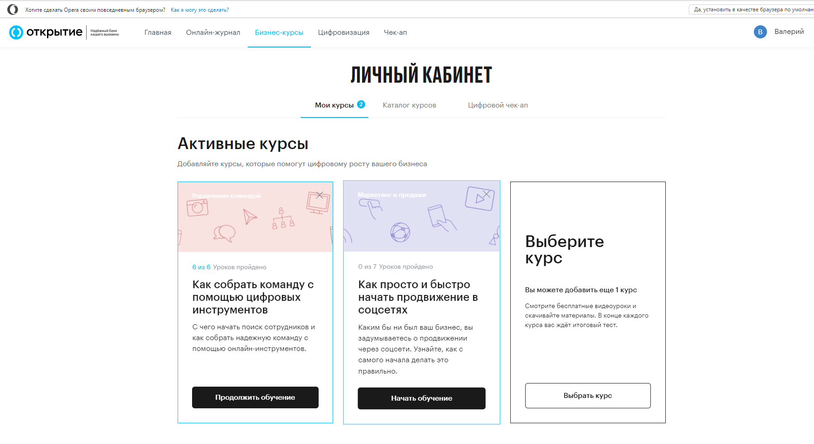
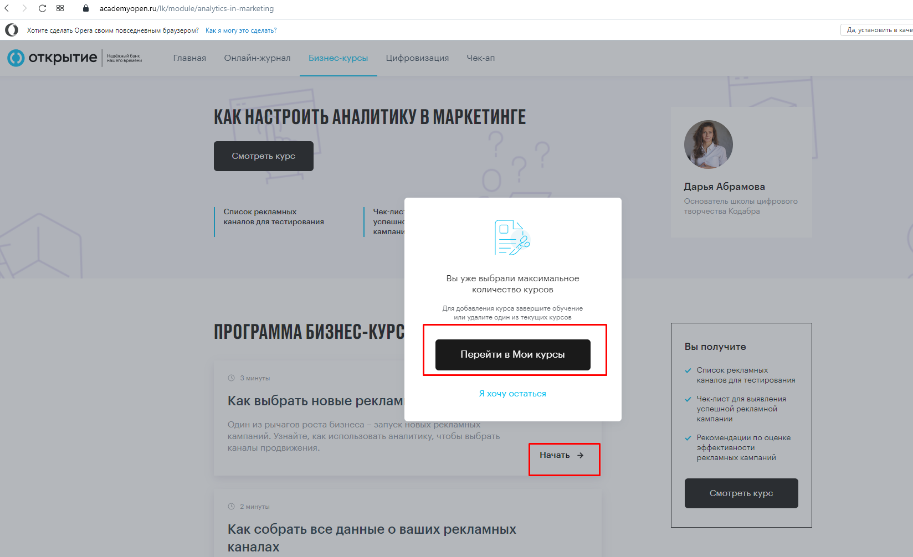
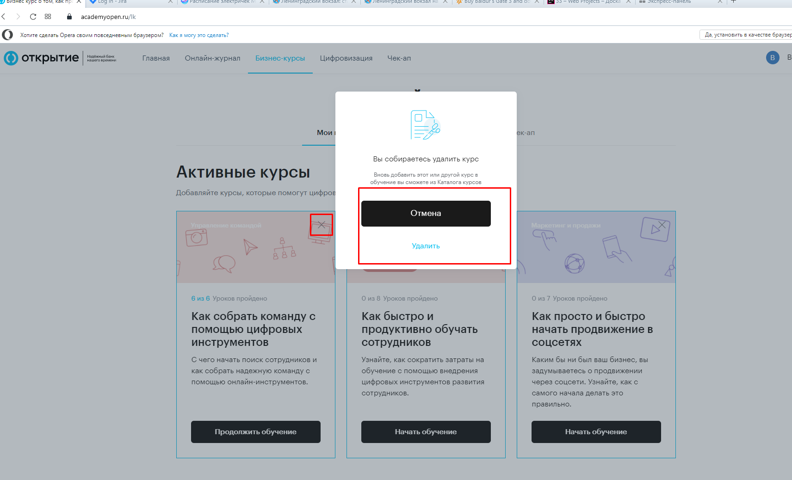
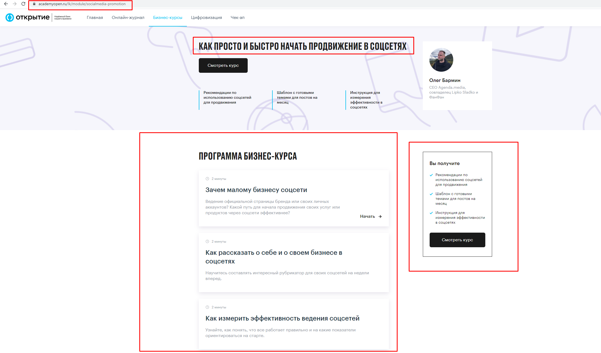

# Карточка курса

Каталог карточек курсов располагаются в ЛК по ссылке для авторизованного пользователя: [https://academyopen.ru/lk](https://academyopen.ru/lk)

Выбранные курсы будут располагаться в разделе "Мои курсы"

В случае, если пользователь ранее проходил курс (начал хотя бы один урок курса) будет отображаться кнопка "Продолжить обучение", по нажатию на которую будет произведен переход на  страницу курса.

В случае если курс не был пройден пользователем, будет отображаться кнопка "Начать обучение". При клике на которую будет произведен переход в соответствующий курс.

В случае, если пользователь не выбрал курс, по кнопке "выбрать курс он будет перенаправлен на страницу каталога курсов [https://academyopen.ru/lk#tab_0](https://academyopen.ru/lk#tab_0)

**Важное замечание!** Введено ограничение на одновременное прохождение курсов. Пользователь в раздел "Мои курсы" может добавить не более **трех курсов.**

При нажатии "Начать обучение" ****четвертого курса, из каталога, и попытке перейти на первый урок, пользователю будет предложено удалить один из имеющихся курсов из раздела "Мои курсы"

Удаление производится значком "Крестика" в правом верхнем углу карточки курса. При попытке удаления пользователю будет отображен попап подтверждения удаления курса:

При нажатии кнопки "Удалить" курс будет удален из раздела "Мои курсы"

# Описание курса

При переходе на соответствующий курс открывается страница курса. Переход по ссылкам ведущим на курс доступны авторизированным пользователям (к примеру [https://academyopen.ru/lk/module/learn-employee](https://academyopen.ru/lk/module/learn-employee)), за исключением курсов, имеющих демоуроки [Уроки для неавторизованного пользователя. (Демо-уроки)](https://www.notion.so/4868ce5906884c9e8d7c3fc527283ee8) :

Страница курса состоит из следующих блоков:

1. Тизер курса: Заголовок/наименование курса; тезисы, которые коротко описывают курс; ФИО лектора; его фото и короткая инфо о нем; и кнопка смотреть курс, при клике на которую пользователя переводит на страницу первого урока курса.
2. Блок "Программа курса", который включает в себя все уроки курса, итоговый тест и кнопку пропустить курс, по нажатию на которую курс будет удален из блока ЛК "Мои курсы"
3. Блок "Вы получите" состоит из коротких тезисов описания курса и кнопкой "Смотреть курс" по нажатию на которую также происходит переход на первый урок курса
