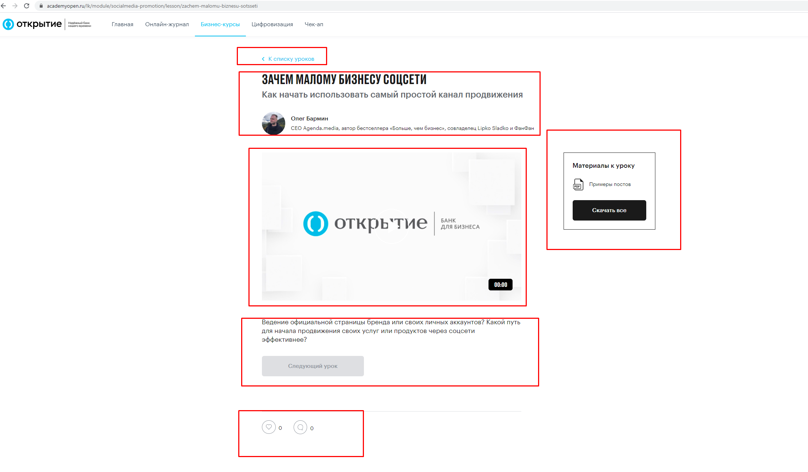

# Карточка урока

Карточка урока состоит из следующих блоков

1. Кнопка "К списку уроков": производит переход на главную страницу курса.
2. Блок "Заголовок урока":  содержит описание урока, краткое описание и фотография/ФИО/описание деятельности
3. Блок "Видео урока": который работает по принципу демоуроков  [Уроки для неавторизованного пользователя. (Демо-уроки)](/Website/Public_page/Demo_lessons.md) 
4. Блок "Переход на следующий урок", который содержит: короткие вопросы по теме урока  и кнопку "Следующий урок", которая становится активной при первом запуске видео урока, при нажатии на которую производится переход к следующему уроку из списка курса.
5. Блок "Материалы к уроку" содержит: файл/файлы для скачивания и кнопка "Скачать все", при нажатию на которую происходит скачивание всех материалов урока
6. Блок с "Лайками" и "Комментариями: описание можно посмотреть по ссылке [Новые фичи](/Website/Public_page/new_features.md)

