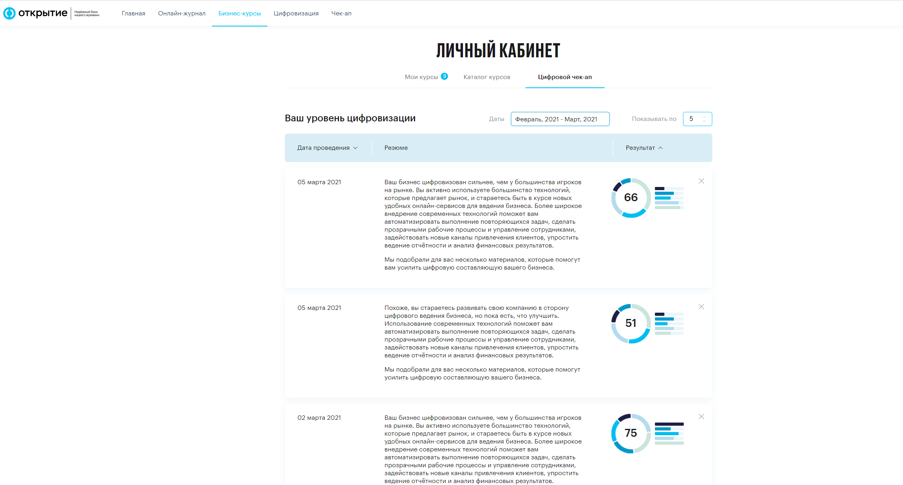
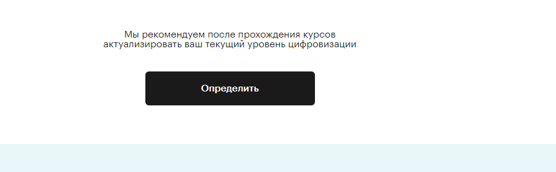

# Личный кабинет

Ссылка: [https://academyopen.ru/lk](https://academyopen.ru/lk)

Дизайн: [https://www.figma.com/file/VGj0ApfoPj2GDLwxDvT56M/open_academy-LK?node-id=16%3A2](https://www.figma.com/file/VGj0ApfoPj2GDLwxDvT56M/open_academy-LK?node-id=16%3A2)

## Блоки страницы:

1. Заголовок
2. Информативная плашка с шагами
3. Вкладки "Мои курсы", "Завершенные курсы", "Яндекс Бизнес, "Яндекс Директ"
4. Демоверсии уроков

Логика выбора вкладки при перехода в ЛК по прямой ссылке либо из меню:

1) Если пользователь имеет активные Курсы - открывается вкладка "Мои курсы" 

2) Если пользователь не имеет активных Курсов - открывается вкладка "Бизнес-цели"

## 1 - Заголовок

Статичный блок, отображается согласно дизайну.

## 2 - Информативная плашка с шагами

Статичный блок, отображается согласно дизайну.

При закрытии блока (нажатие на кнопку "Крестик") блок перестает отображаться в рамках сессии браузера и авторизации пользователя.

## 3 - Вкладки "Мои курсы", "Каталог курсов", "Цифровой чекап", "Яндекс Бизнес", "Яндекс Директ"

См. описание на вложенных страницах:

[Вкладка "Мои курсы"](./Personal_Area/My_courses_tab.md)

[Вкладка "Завершенные курсы"](./Personal_Area/Completed_Courses.md)

[Вкладка"Яндекс Бизнес"](./Personal_Area/Yandex_business.md)

[Вкладка "Яндекс Директ"](./Personal_Area/Yandex_direct.md)

Каталог курсов - аналогичен описанному блоку, без пункта 1 "Карусель"

[Бизнес курсы](./Courses/Authorized_business_courses.md)

## **Цифровой чекап**

Вкладка цифрового чекапа отображает все результаты пройденных тестов

Данная страница содержит следующие элементы:

**Фильтр "Дата**": при выборе которого отображаются только те результаты чекапа, которые входят в указанный диапазон

**Блок "Показывать по":** отображает то количество результатов, которое указано в поле

**Блок "Результаты чекапа":**  Содержит три информационных столбца - "Дата проведения" (указывается дата прохождения теста), Резюме (Резюме и рекомендация исходя из полученных баллов), Результат (отображается в виде диаграммы: в центре общий результат, по кругу, разными цветами указаны сегменты, которые отображают набранные баллы в той или иной категории вопросов. Столбцовая диаграмма дублирует круговую)

**Блок "Актуализировать текущий уровень цифровизации":**  по нажатию кнопки "Определить" происходит переход на страницу [https://academyopen.ru/checkup](http://master.openacademy-front.huskyjam.com/checkup)

