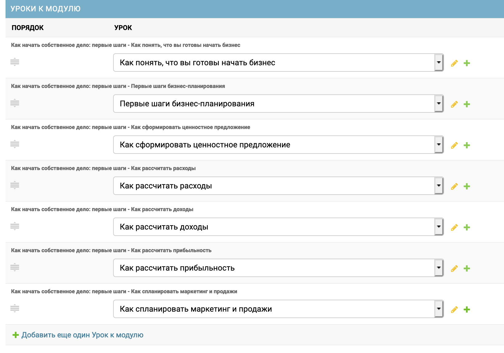

Курсы
=============

**Курс** \- сущность, включающая в себя уроки, раскрывающие определенный узкий набор знаний. Например, "Поиск клиентов в интернете", "Настройка аналитики в маркетинге" и т.п. Курс может содержать в себе один или более Урок.

**Редактируются на странице:** [https://academyopen.ru/admin/modules/module/](https://academyopen.ru/admin/modules/module/)

**Дополнительно:**

1) На странице редактирования Курса имеется возможность быстрого изменения/добавления Урока из списка доступных Уроков:

#### Поля и структура

| Название | Тип | Обязательное | Комментарий | Использование |
| --- | --- | --- | --- | --- |
| Доступно | Флаг | Обязательное | Включает или отключает отображение Курса, привязанного к Цели, в списке доступных | Сайт + Мобильные приложения |
| Цель | Выбор из доступных | Обязательное | Привязывает Цель к Курсу | Сайт + Мобильные приложения |
| Бизнес-цель | Выбор из доступных | Обязательное | Привязывает Курс к Бизнес-цели | Сайт |
| Маркер | Текст (любой длины) | Обязательное | Краткое описание курса (тег) | Сайт + Мобильные приложения |
| Название  | Текст (любой длины) | Обязательное | Название Курса, обычно совпадает с названием Цели | Сайт + Мобильные приложения |
| Описание | Текст (любой длины) | Обязательное | Описание Курса | Сайт + Мобильные приложения |
| Изображение | Файл | Обязательное | Основная обложка Курса. Рекомендуемое соотношение сторон: 2 к 1. Например, ширине - 1000, высота - 500 | Сайт + Мобильные приложения |
| Обложка | Файл | Обязательное | Большая обложка Курса (используется на странице Курса). Рекомендуемое соотношение сторон: 3.5 к 1. Например, ширина - 1920, высота - 540. | Сайт + Мобильные приложения |