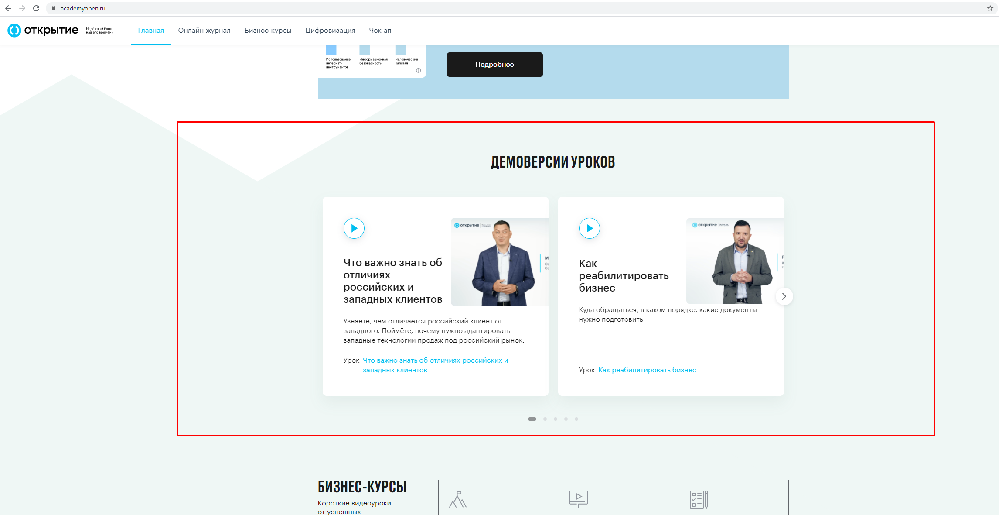
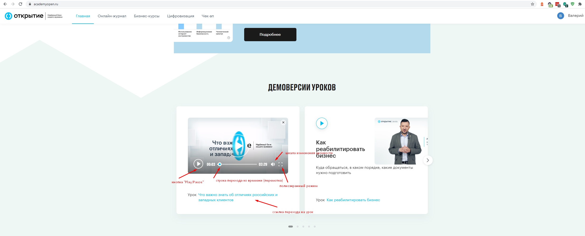
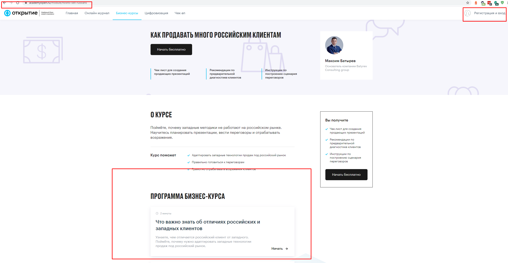
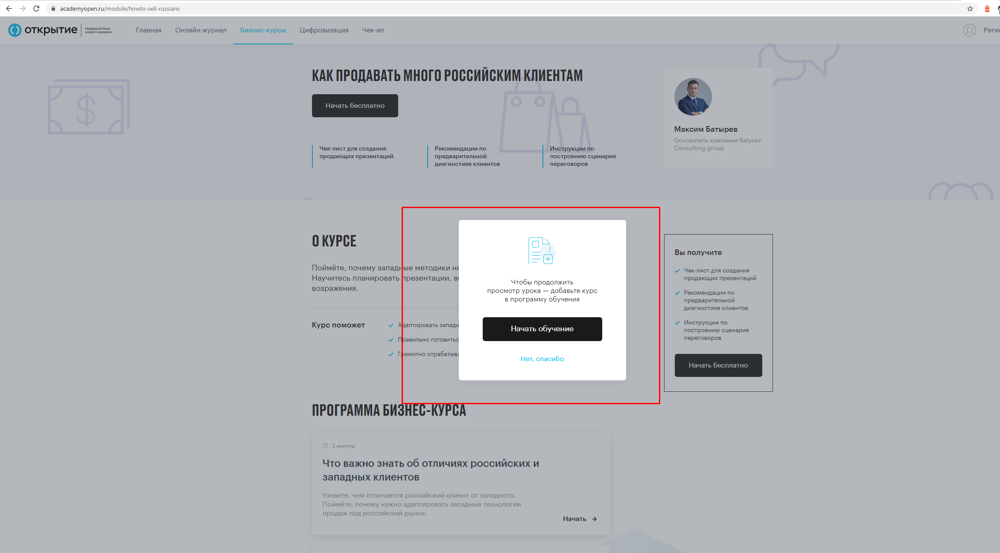
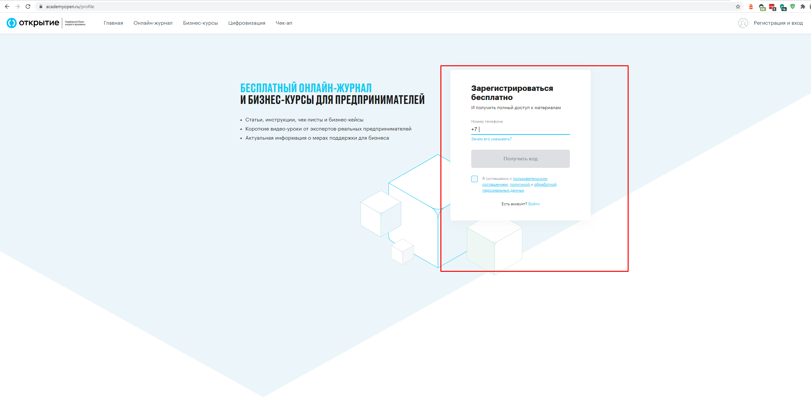

# Уроки для неавторизованного пользователя. (Демо-уроки)

Некоторые уроки открыты для публичного доступа, для предоставления возможности без регистрации просмотреть один урок. Они располагаются на главной странице в блоке "Демоверсии уроков"

При клике на кнопку проигрывания видео запуститься соответствующий материал. Окно можно перевести в полноэкранный режим, строка прогресс-бара может проводить навигацию по времени, элемент "Громкость" уменьшает/увеличивает громкость текущего видео. Кнопка "Play/Pause" ставит на паузу и продолжает проигрывание урока:

При клике на наименование урока производится переход на страницу курса. 

При нажатии кнопки "Начать" появится попап приглашения на обучение:

В случае нажатия на кнопку "Нет, спасибо" пользователь остается на странице выбранного курса.

В случае нажатия кнопки "Начать обучение" незарегистрированного пользователя перенаправят на страницу авторизации/регистрации.

