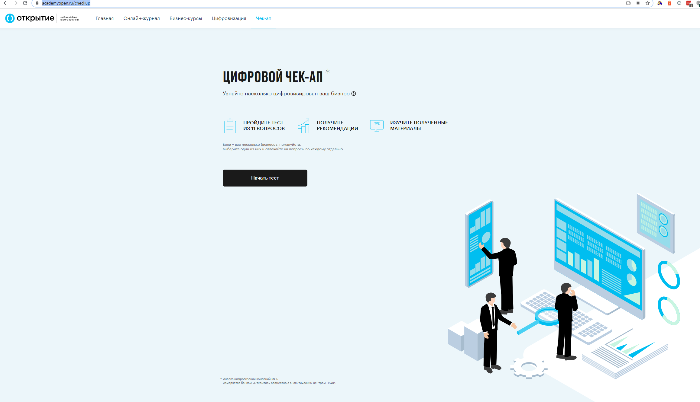
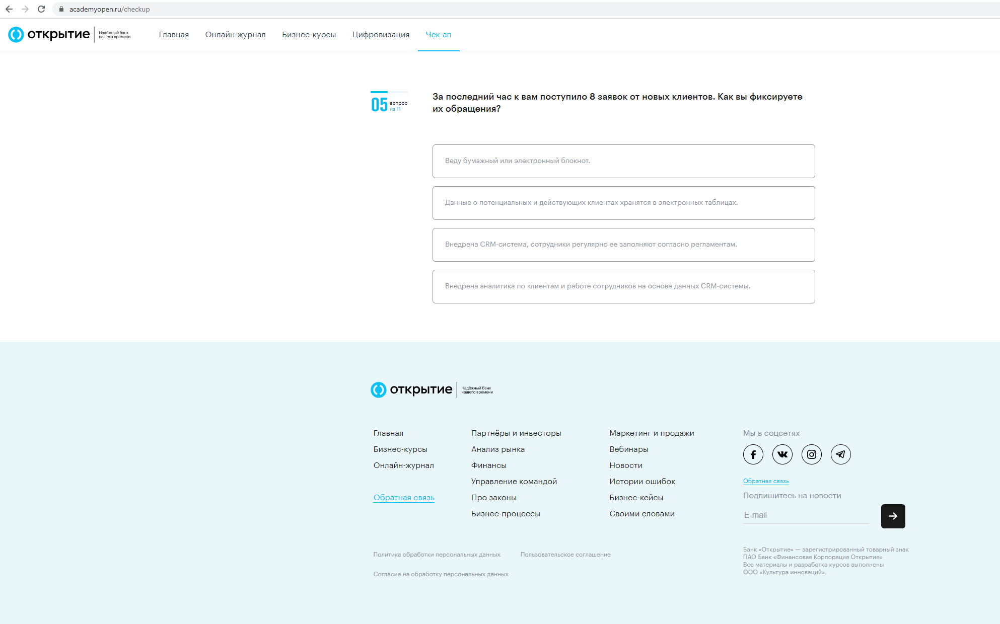
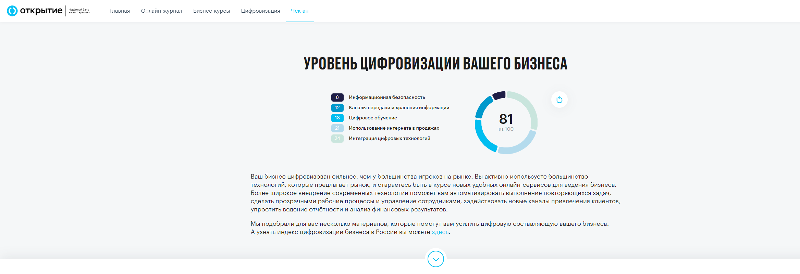
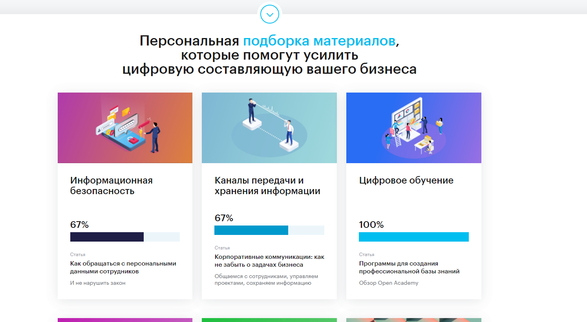

# Цифровой чекап

Цифровой чекап представляет из себя опросник из 10 вопросов, который определяет уровень цифровизации клиента. Результатом прохождения будет число, являющееся индексом цифровизации пользователя

Для получения максимального балла необходимо выбирать самые нижние ответы.

**Страница приглашения к опросу:**

Пример страницы с вопросом:

**Страница с результатами опроса:**

Содержит следующие блоки:

Результаты опроса

Содержит информацию о результатах прохождения чекапа, элементом "Пройти тест заново"

и

**Персональная подборка материалов**

Состоящую из статей Онлайн журнала, которые выдаются согласно алгоритму расчета, исходя из ранее предоставленных ответов
