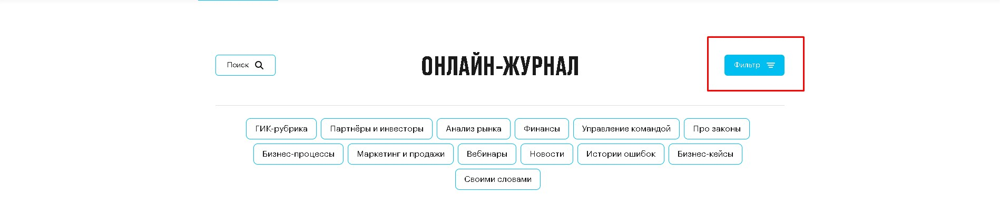
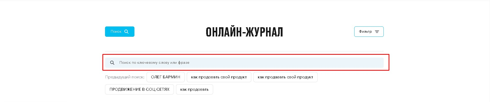
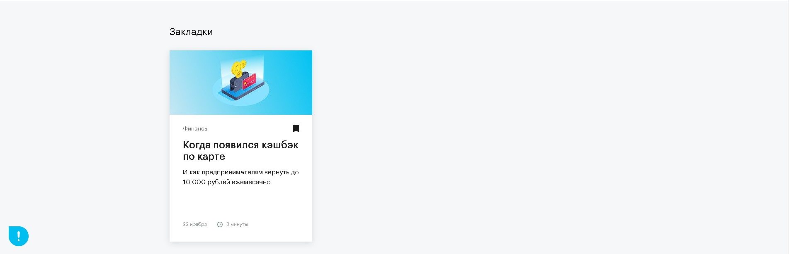
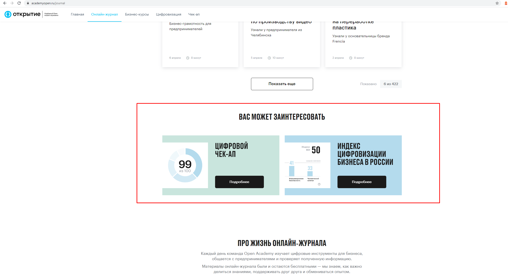
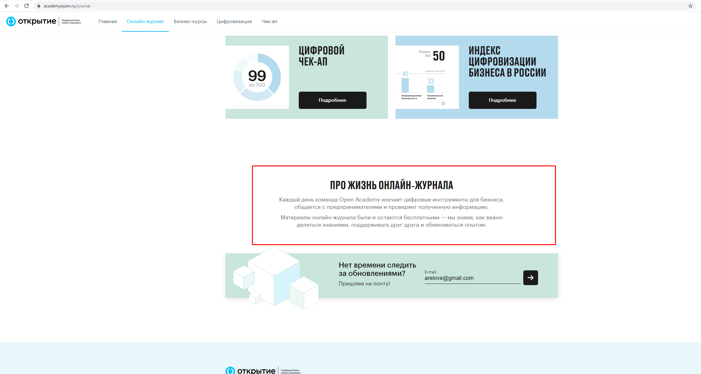
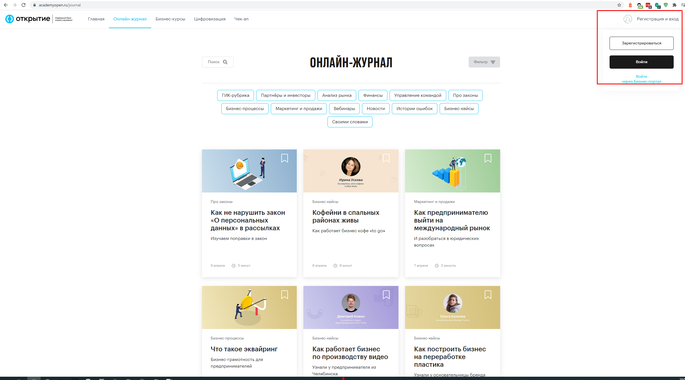
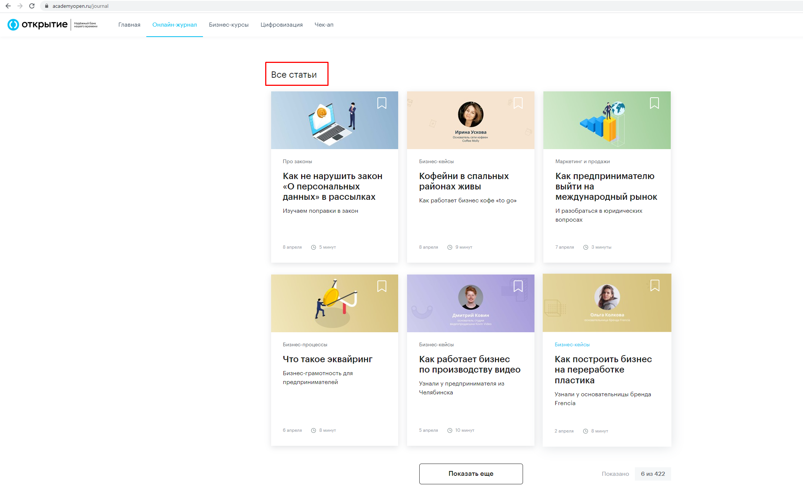
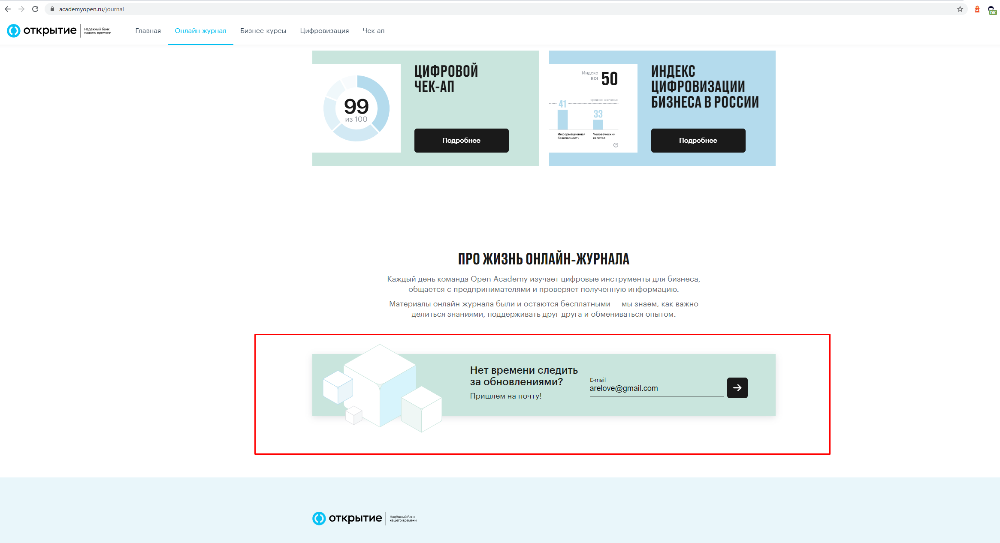

# Онлайн-Журнал
Добавить скрины
Ссылка: [https://academyopen.ru](https://academyopen.ru/journal)

Дизайн: [https://www.figma.com/file/wVQs5Z2rvbQG8JB5PQU5Xu/Open-Academy.-Главная-страница](https://www.figma.com/file/wVQs5Z2rvbQG8JB5PQU5Xu/Open-Academy.-%D0%93%D0%BB%D0%B0%D0%B2%D0%BD%D0%B0%D1%8F-%D1%81%D1%82%D1%80%D0%B0%D0%BD%D0%B8%D1%86%D0%B0)

## Блоки на странице

1. Блок "Поисковая строка/Фильтр"
2. Блок "Закладки"
3. Блок "Вас может заинтересовать"
4. Блок" Про жизнь онлайн журнала"
5. Блок "Каталог статей/Все статьи"
6. Блок "Нет времени следить за обновлениями?"
7. Общий блок "Футер"

## 1 - Блок "Поисковая строка/Фильтр"

Поле ввода поискового запроса, в которому будет производится поиск. Ниже строки поиска содержатся результаты предыдущих поисков, для быстрого заполнения в поле ввода.

При нажатии кнопки "Поиск" строка поиска пропадает/появляется

Блок "Фильтр" отображает список существующих категорий рубрик, по которым можно проводить фильтрацию.

Текущий список активных рубрик: Партнеры и инвесторы, Анализ рынка, Финансы, Управление командой, Про законы, Бизнес-процессы, Маркетинг и продажи, Вебинары, Новости, Истории ошибок, Бизнес кейсы, Своими словами

При нажатии кнопки "Фильтр" список категорий пропадает/появляется.

В один промежуток времени может быть активен либо функционал поиска, либо функционал фильтра.

Фильтр: 

Поиск:

## 2 - Блок "Закладки"

Динамический блок. 

В блок могут быть добавлены избранные статьи из общего списка. Добавление/удаление избранной статьи производится нажатием на соответствующий элемент.

## 3 - Блок "Вас может заинтересовать"

## 4 - Блок "Про жизнь онлайн журнала"

## 5 - Блок "Каталог статей/Все статьи"
Для неавторизованного пользователя отображается только "Каталог статей"

 

Для авторизованного пользователя после блока закладки отображается тот же блок, только с названием "Все статьи"

## 6 - Блок "Нет времени следить за обновлениями?"

Статичный блок с элементами ввода электронной почты. Верстается по утвержденному макету.

## 7 - Блок "Футер"

Идентичен для всех страниц имеющих футер

 

