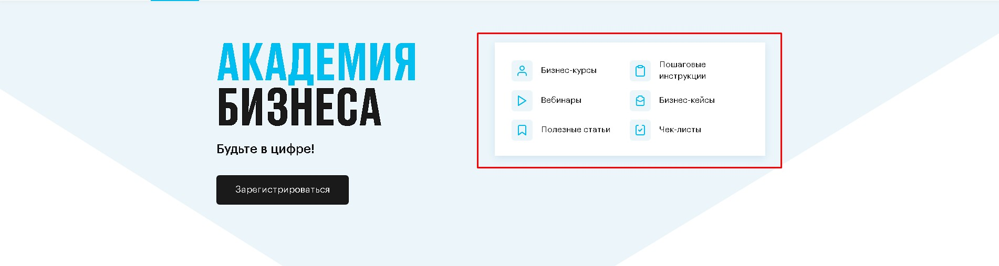
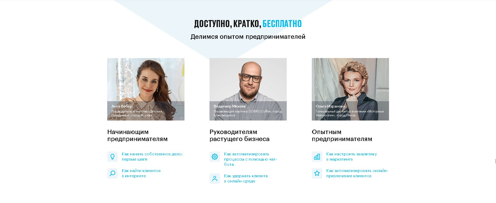
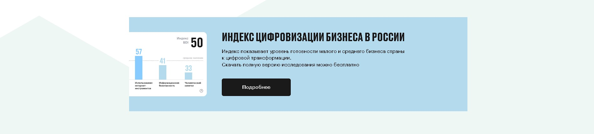
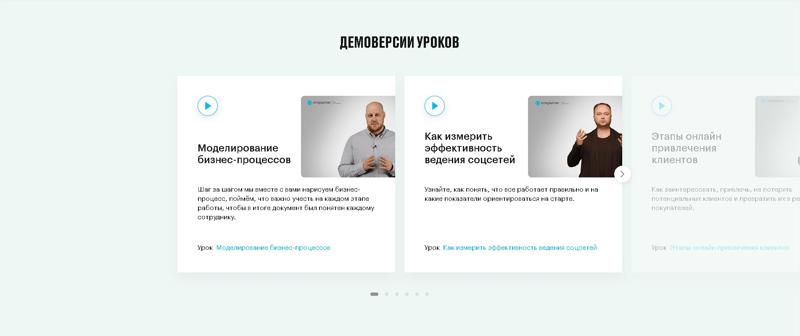
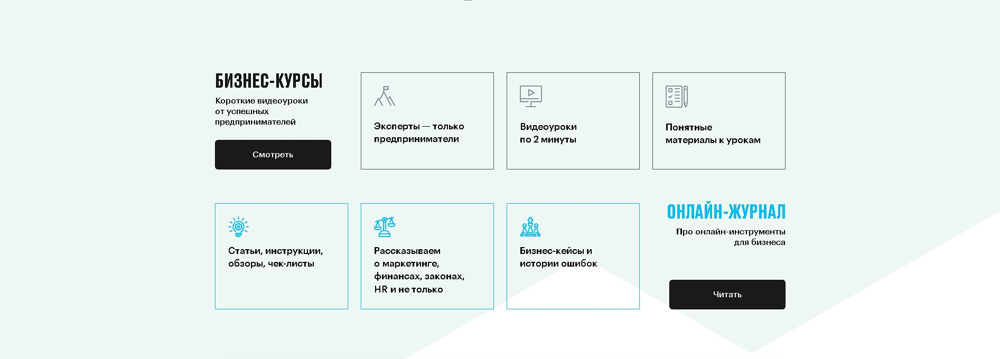
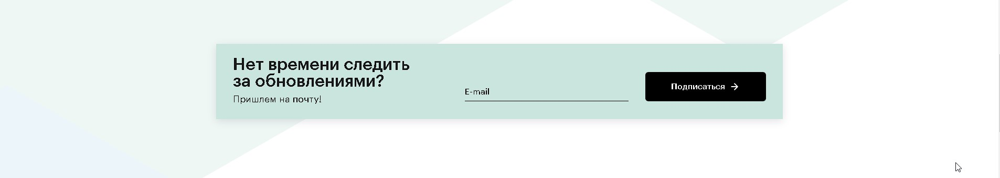
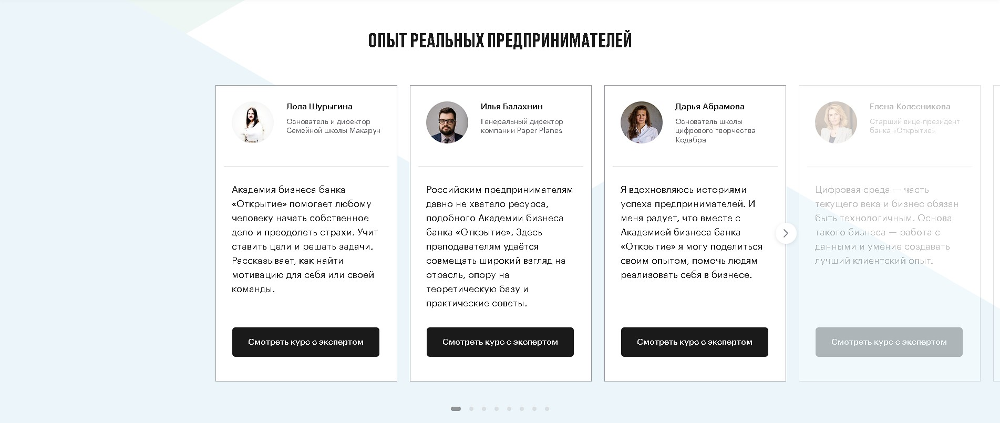
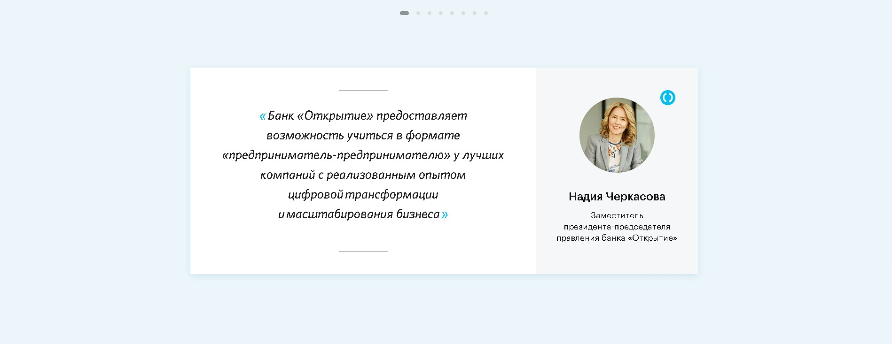
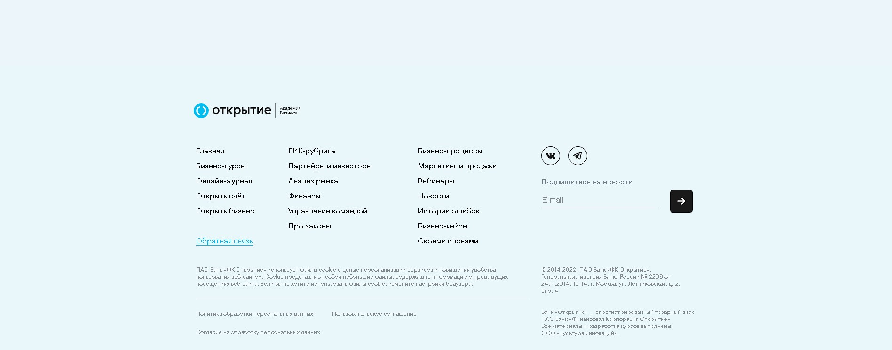
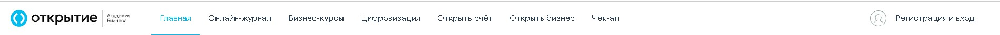

# Главная страница

Ссылка: [https://academyopen.ru](https://academyopen.ru/)

Дизайн: [https://www.figma.com/file/wVQs5Zmain_page2rvbQG8JB5PQU5Xu/Open-Academy.-Главная-страница](https://www.figma.com/file/wVQs5Z2rvbQG8JB5PQU5Xu/Open-Academy.-%D0%93%D0%BB%D0%B0%D0%B2%D0%BD%D0%B0%D1%8F-%D1%81%D1%82%D1%80%D0%B0%D0%BD%D0%B8%D1%86%D0%B0)
## **Блоки на странице**

1. Блок "Open Academy"
2. Блок "Навигационные иконки"
3. Блок "Доступно, кратко, бесплатно"
4. Блок "Цифровой чекап"
5. Блок" Индекс цифровизации бизнеса"
6. Блок "Демоверсии уроков"
7. Блок "Бизнес-курсы"
8. Блок "Нет времени следить за обновлениями?"
9. Блок "ОПЫТ РЕАЛЬНЫХ ПРЕДПРИНИМАТЕЛЕЙ"
10. Блок "Блок презентация от Надии Черкасовой"
11. Блок "Футер"
12. Блок "Хедер"

## 1 - **Блок "Open Academy"**

Статичный блок.  Верстается по утвержденному макету.

Кнопка блока имеет два состояния:

- *Для неавторизованного пользователя -* Кнопка _"Зарегистрироваться"_ с ссылкой на ***Страницу авторизации/регистрации*.**
    - После регистрации/авторизации - переход по логике  блока "Регистрации/Авторизации"
    
    *Для авторизованного пользователя -* Кнопка _"Продолжить обучение"_ с ссылкой на ***Личный кабинет***
## 2 - **Блок** "Навигационные иконки"

Статичный блок с кнопками переходов.. Верстается по утвержденному макету.

содержит следующие кнопки с переходами:

Бизнес курсы - [https://academyopen.ru/about](https://academyopen.ru/about)

Вебинары - [https://academyopen.ru/journal/rubrics/webinars](https://academyopen.ru/journal/rubrics/webinars)

Полезные статьи - [https://academyopen.ru/journal](https://academyopen.ru/journal)

Пошаговые инструкции - [https://academyopen.ru/journal/426](https://academyopen.ru/journal/426)

Бизнес кейсы - [https://academyopen.ru/journal/rubrics/business-cases](https://academyopen.ru/journal/rubrics/business-cases)

Чек-листы - [https://academyopen.ru/journal/425](https://academyopen.ru/journal/425)

## 3 - **Блок "Доступно, кратко, бесплатно"**

Статичный блок. Верстается по утвержденному макету.

Имеет три блока с ссылками на курсы:

Начинающим предпринимателям: [https://academyopen.ru/module/start-own-business](https://academyopen.ru/module/start-own-business), [https://academyopen.ru/module/find-clients](https://academyopen.ru/module/find-clients)

Руководителям растущего бизнеса: [https://academyopen.ru/module/automate-chatbot](https://academyopen.ru/module/automate-chatbot), [https://academyopen.ru/module/keep-clients](https://academyopen.ru/module/keep-clients)

Опытным предпринимателям: [https://academyopen.ru/module/analytics-in-marketing](https://academyopen.ru/module/analytics-in-marketing), [https://academyopen.ru/module/attracting-clients](https://academyopen.ru/module/attracting-clients)

## 4 - **Блок "Цифровой чекап"**

Статичный блок. Верстается по утвержденному макету.

Имеет кнопку перехода на страницу чекапа: [https://academyopen.ru/checkup](https://academyopen.ru/checkup)

## 5 - **Блок  "Индекс цифровизации бизнеса"**

Статичный блок. Верстается по утвержденному макету.

Имеет кнопку перехода на страницу цифровизации бизнеса [https://academyopen.ru/digital](https://academyopen.ru/digital)

## 6 - **Блок "Демоверсии уроков"**

Динамический блок "Карусель". Верстается по утвержденному макету.

Имеет изменяемые в админке блоки демоуроков.
[https://academyopen.ru/admin/demo_lesson/](https://academyopen.ru/admin/demo_lesson/)

Отображает превью видео, само видео и название урока с переходом в соответствующий урок
## 7 - **Блок "Бизнес-курсы"**

Статичный блок с элементами перехода. Верстается по утвержденному макету.

Кнопка "смотреть": [https://academyopen.ru/about](https://academyopen.ru/about)

Ссылки переходов блоков::

Эксперты только предприниматели: [https://academyopen.ru/about](https://academyopen.ru/about)

Видеоуроки по 2 минуты: [https://academyopen.ru/about](https://academyopen.ru/about)

Понятные материалы к урокам: [https://academyopen.ru/about](https://academyopen.ru/about)

Статьи, инструкции, обзоры, чеклисты: [https://academyopen.ru/journal](https://academyopen.ru/journal)

Рассказываем о маркетинге, финансах, законах, HR  и не только: [https://academyopen.ru/journal](https://academyopen.ru/journal)

Бизнес-кейсы и истории ошибок: [https://academyopen.ru/journal](https://academyopen.ru/journal)

Кнопка "Читать онлайн журнал": [https://academyopen.ru/journal](https://academyopen.ru/journal)

## 8 - **Блок "Нет времени следить за обновлениями?"**

Статичный блок с элементами ввода электронной почты. Верстается по утвержденному макету.

## 9 - **Блок "ОПЫТ РЕАЛЬНЫХ ПРЕДПРИНИМАТЕЛЕЙ"**

Динамический блок "карусель" с элементами перехода.

Содержит карточки с текстом и информацией о предпринимателе 

Кнопка "Смотреть курс с экспертом" производит переход на [https://academyopen.ru/module/1](https://academyopen.ru/module/1)
## 10 - **Блок "Блок презентация от Надии Черкасовой"**

Статичный блок. Верстается по утвержденному макету. 

Имеет блок с текстом и информацию о Надие Черкасовой.

## 11 - **Общий блок "Футер"**

Блок с навигационными ссылками сайта, ссылками на соцсети и подпиской на новости.

## 12 - **Блок "Хедер"**

Блок с навигационными ссылками сайта, ссылкой на pop-up окно Авторизации и Регистрации.

